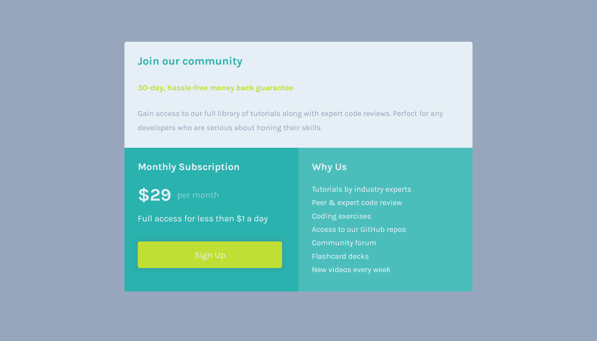

# Frontend Mentor - Single price grid component solution

This is a solution to the [Single price grid component challenge on Frontend Mentor](https://www.frontendmentor.io/challenges/single-price-grid-component-5ce41129d0ff452fec5abbbc). Frontend Mentor challenges help you improve your coding skills by building realistic projects.

## Table of contents

- [Overview](#overview)
  - [The challenge](#the-challenge)
  - [Screenshot](#screenshot)
  - [Links](#links)
- [My process](#my-process)
  - [Built with](#built-with)
  - [What I learned](#what-i-learned)
- [Author](#author)

## Overview

### The challenge

Users should be able to:

- View the optimal layout for the component depending on their device's screen size
- See a hover state on desktop for the Sign Up call-to-action

### Screenshot

Add a screenshot of your solution. The easiest way to do this is to use Firefox to view your project, right-click the page and select "Take a Screenshot". You can choose either a full-height screenshot or a cropped one based on how long the page is. If it's very long, it might be best to crop it.

Alternatively, you can use a tool like [FireShot](https://getfireshot.com/) to take the screenshot. FireShot has a free option, so you don't need to purchase it.

Then crop/optimize/edit your image however you like, add it to your project, and update the file path in the image above.

**Note: Delete this note and the paragraphs above when you add your screenshot. If you prefer not to add a screenshot, feel free to remove this entire section.**

### Links

- Solution URL: [FEM Solution](https://www.frontendmentor.io/solutions/responsive-mobile-first-single-price-grid-component-card-vVrn4AUNFO)
- Live Site URL: [Live Site](https://christian-prasetya.github.io/fem-single-price-grid-component/)

## My process

### Built with

- Semantic HTML5 markup
- CSS Custom Properties
- [SaSS](https://sass-lang.com/) - CSS Preprocessor
- [BEM Styling](https://getbem.com/) - CSS Block, Element, Modifier styling style
- Flexbox
- CSS Grid
- Mobile-first workflow
- [Andy Bell Modern CSS Reset](https://piccalil.li/blog/a-modern-css-reset/) - For basic style reset, with some modification

### What I learned

I started this challenge with the goals to learn more about CSS layouting, especially by using Grid system. It a bit challanging at first, with lots of googling and browsing through stack overflow, MDN, and W3C trying to find the right way to do Grid layout without any framework.

It finally did, I know it's not perfect, but here is this.

The key lesson I take from this challenge is, never afraid to apply your newly learned skill. There's a rainbow after the storm, all we need to do is passing through the storm head first.

## Author

- GitHub - [christian-prasetya](https://github.com/christian-prasetya)
- Frontend Mentor - [@christian-prasetya](https://www.frontendmentor.io/profile/christian-prasetya)
- Instagram - [@cprasetya28](https://www.instagram.com/cprasetya28)
- Showwcase - [@cprasetya28](https://www.showwcase.com/cprasetya28)
